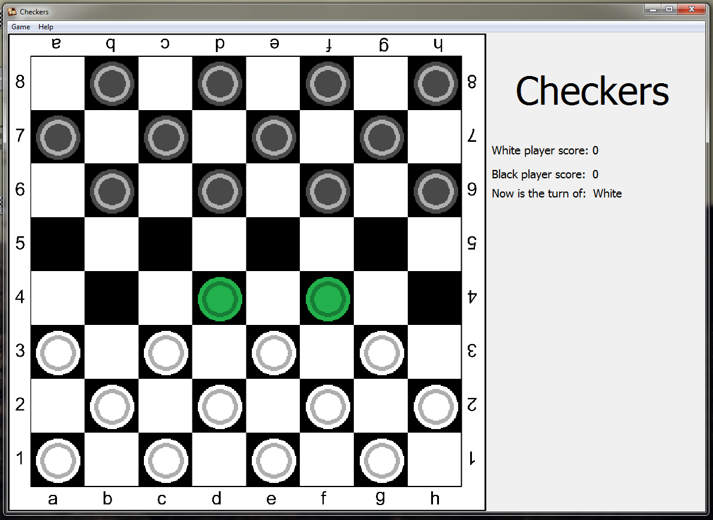
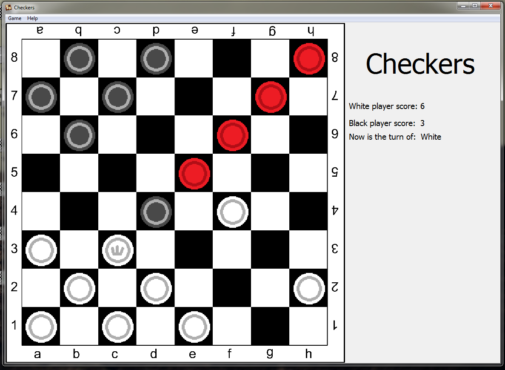
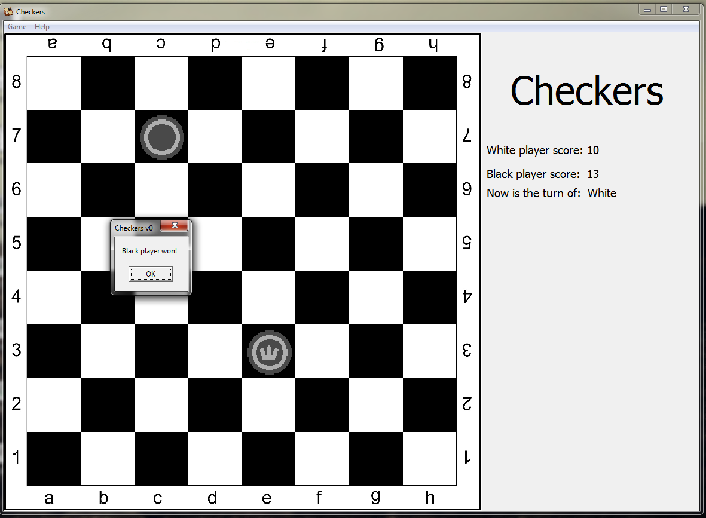

# iasa-checkers
My project on the first year of Bachelor's studies. 
A simple project. 
Two players can play in turns. The rules are for Russian Chackers.
All the coorect moves are allowed and shown with green and red colours on board.
May contain minor bugs.

Year - 2015.
Written on Delphi.
